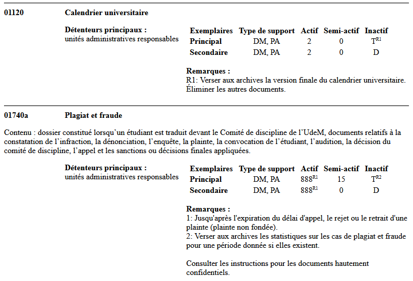

# constellio-export-calendrier
Constellio 11 n'offre (actuellement?) plus la possibilité d'exporter les règles de conservation dans un format condensé.
Ce dépôt contient une feuille de style permettant de réaliser, à partir de l'export XML des règles dans Constellio, une sortie avec dans un format similaire à celui offert dans les versions précédentes.

## Utilisation
1. À partir de Pilotage->Calendrier de conservation, cliquez sur l'option Exporter toutes les règles de conservation (XML).
2. Placez le fichier que vous venez de télécharger dans le même dossier que le fichier `calendrier-conservation.xslt`.
3. Éditez dans un éditeur texte le fichier XML de l'exportation que vous venez de réaliser et ajoutez modifiez le fichier XML comme suit :
   ```xml
   <?xml version="1.0" encoding="UTF-8"?>
   <?xml-stylesheet type="text/xsl" href="calendrier-conservation.xslt" ?>
   ```
4. Ouvrez maintenant le fichier XML dans votre navigateur web.
5. Faites une impression PDF du résultat.

## Exemple de résultat
